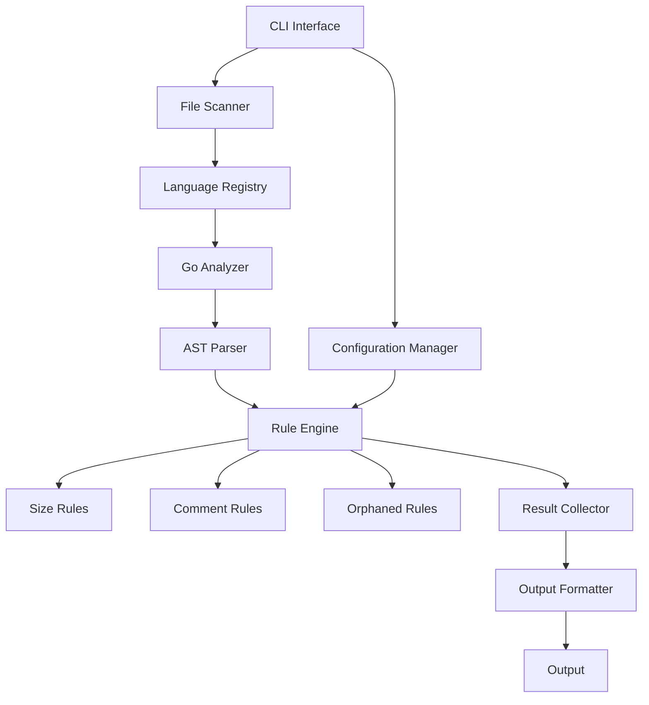
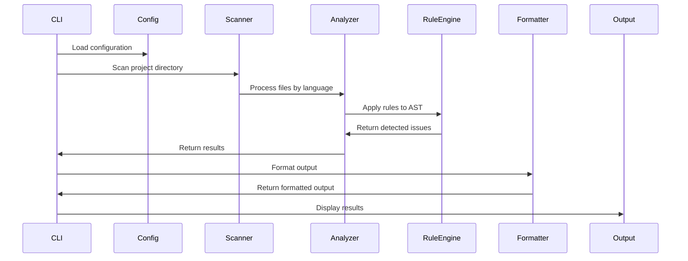

# AgentLint System Design

## Component Interactions



## Data Flow



## Core Interfaces

### Analyzer Interface
```go
type Analyzer interface {
    Analyze(ctx context.Context, filePath string, config Config) ([]Result, error)
    SupportedExtensions() []string
    Name() string
}
```

### Rule Interface
```go
type Rule interface {
    ID() string
    Name() string
    Description() string
    Category() RuleCategory
    Severity() Severity
    Check(ctx context.Context, node interface{}, config Config) *Result
}
```

### Result Types
```go
type Result struct {
    RuleID      string
    RuleName    string
    Category    RuleCategory
    Severity    Severity
    FilePath    string
    Line        int
    Column      int
    Message     string
    Suggestion  string
}

type RuleCategory string

const (
    CategorySize      RuleCategory = "size"
    CategoryComments  RuleCategory = "comments"
    CategoryOrphaned  RuleCategory = "orphaned"
)

type Severity string

const (
    SeverityError   Severity = "error"
    SeverityWarning Severity = "warning"
    SeverityInfo    Severity = "info"
)
```

## Rule Implementation Strategy

### 1. Size Detection Rules
- **Function Size**: Count lines in function bodies
- **File Size**: Count total lines in files
- **Parameter Count**: Count function parameters
- **Nesting Depth**: Measure nested control structures

### 2. Comment Analysis Rules
- **Comment Ratio**: Calculate comment-to-code ratio
- **Redundant Comments**: Identify comments that repeat code
- **Documentation Coverage**: Check exported function documentation
- **Comment Quality**: Analyze comment meaningfulness

### 3. Orphaned Code Detection
- **Unused Functions**: Track function definitions and calls
- **Unused Variables**: Track variable declarations and usage
- **Dead Code Paths**: Identify unreachable code blocks
- **Unused Imports**: Track import statements and usage

## Configuration Architecture

### Configuration Hierarchy
1. Default configuration (built-in)
2. Global configuration file
3. Project configuration file
4. Command-line flags

### Configuration Structure
```go
type Config struct {
    Rules    RulesConfig    `yaml:"rules"`
    Output   OutputConfig   `yaml:"output"`
    Language LanguageConfig `yaml:"language"`
}

type RulesConfig struct {
    FunctionSize     FunctionSizeConfig     `yaml:"functionSize"`
    FileSize         FileSizeConfig         `yaml:"fileSize"`
    Overcommenting   OvercommentingConfig   `yaml:"overcommenting"`
    OrphanedCode     OrphanedCodeConfig     `yaml:"orphanedCode"`
}
```

## Performance Considerations

### Parallel Processing
- Process multiple files concurrently using worker pools
- Limit concurrent goroutines based on CPU cores
- Implement context cancellation for graceful shutdown

### Memory Management
- Stream file processing to avoid loading entire project into memory
- Reuse AST visitors where possible
- Implement garbage collection hints for large analyses

### Caching Strategy
- Cache parsed ASTs for unchanged files
- Implement file modification time checking
- Consider persistent cache for large projects

## Error Handling Strategy

### Error Categories
1. **Configuration Errors**: Invalid configuration values
2. **Parse Errors**: Syntax errors in source files
3. **Analysis Errors**: Runtime errors during analysis
4. **Output Errors**: Issues with result formatting

### Error Handling Approach
- Continue processing other files when individual files fail
- Provide clear error messages with context
- Implement error aggregation for batch operations
- Use structured error types for better error handling

## Testing Strategy

### Unit Testing
- Test each rule implementation in isolation
- Mock AST nodes for targeted testing
- Test configuration parsing and validation
- Test output formatters with various result sets

### Integration Testing
- Test complete analysis workflow
- Test with real Go projects of varying complexity
- Test configuration override behavior
- Test CLI interface with various options

### Performance Testing
- Measure analysis time for projects of different sizes
- Test memory usage with large codebases
- Benchmark individual rule performance
- Test concurrent processing effectiveness

## Future Extensibility

### Language Plugin System
```go
type Plugin interface {
    Initialize(config Config) error
    GetAnalyzer() Analyzer
    GetDefaultConfig() Config
}
```

### Auto-Fixing Framework
```go
type Fixer interface {
    CanFix(result Result) bool
    Fix(ctx context.Context, filePath string, result Result) error
}
```

### Advanced Analysis Features
- Code similarity detection
- Pattern-based analysis
- Machine learning integration
- Cross-file analysis capabilities